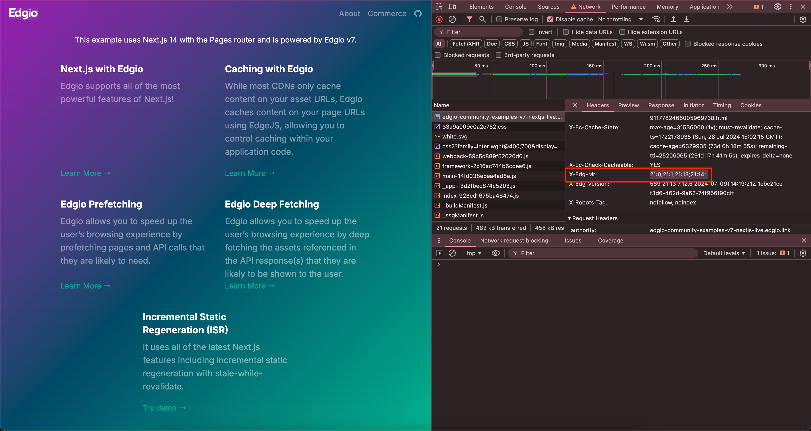
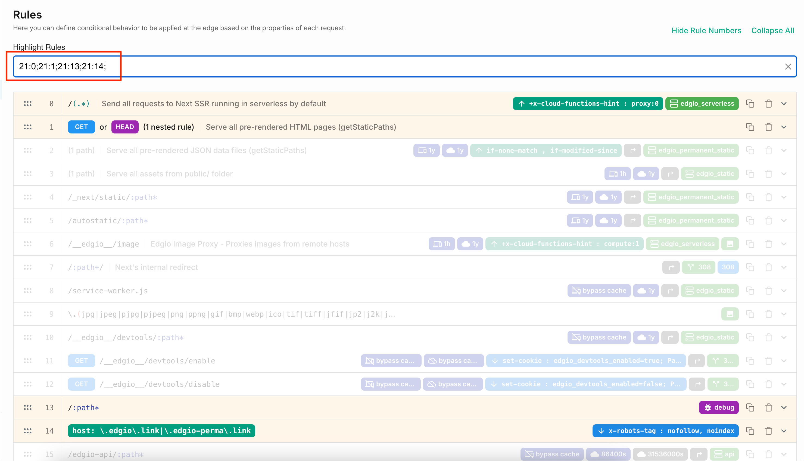
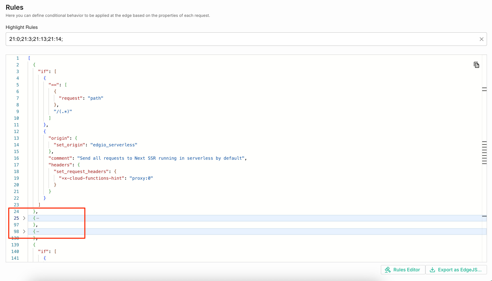

# edgio-rules-highlighter

## Description

The **edgio-rules-highlighter** is a Tampermonkey script designed to visually identify which rules have been applied to a request based on the `x-edg-mr` response header. This script is particularly useful for developers and testers working with Edgio, allowing them to quickly see the impact of different rules on their web applications.

## Features

- Automatically highlights the matches rules in both the Rules Editor and JSON Editor views.
- Easy to install and configure with Tampermonkey.

## Installation

1. **Install Tampermonkey**: If you haven't already, install the Tampermonkey extension for your browser. You can find it in the [Chrome Web Store](https://chrome.google.com/webstore/detail/tampermonkey/dhdgffkkebhmipfmgdfohffgmlcgejag) or the [Firefox Add-ons](https://addons.mozilla.org/en-US/firefox/addon/tampermonkey/).

2. **Add the Script**:

   - Click on the Tampermonkey icon in your browser toolbar.
   - Select "Create a new script".
   - Copy and paste the [script code](script.js) into the editor.
   - Save the script.

3. **Usage**:
   - Copy the `x-edg-mr` response header value from your browser's network tab.
     
   - Navigate to your property in the Edgio Console (https://edgio.app).
   - Click on the "Rules" tab.
   - The script will automatically run and provide an input field where you can enter the `x-edg-mr` response header value.
   - The script will then highlight the rules that were applied to the request.
     
   - Rules in the JSON Editor view will be collapsed if they were _not_ applied.
     

## Contributing

If you would like to contribute to this project, feel free to submit a pull request or open an issue for any bugs or feature requests.

## License

This project is licensed under the MIT License - see the [LICENSE](LICENSE) file for details.
